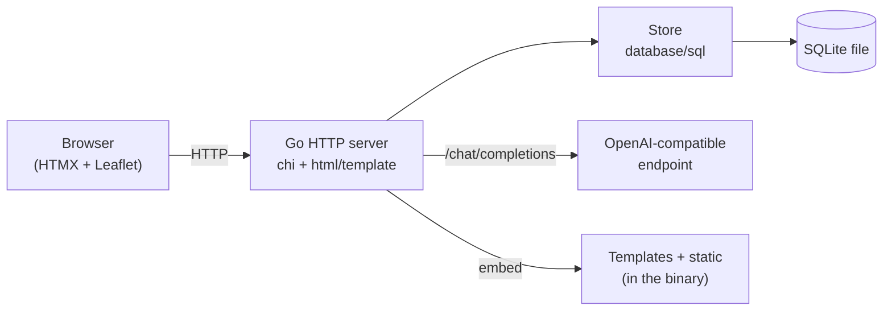

# 🌴 VacationPlanner

A web-based vacation planner written in **Go** with a modern, lightweight server-rendering
architecture (HTMX + Leaflet), SQLite persistence, OpenAI-compatible AI recommendations,
a **multi-language UI (English / German)**, and a **multi-arch, distroless** Docker image.

## Features

### Trips & dashboard

- **Manage vacations** – multiple planned trips, each with a title, destination, date range
  (from/to), free-form notes and an optional **budget**, **number of people** and map location.
- **Dashboard** – a card per trip with a **budget donut** (spent vs. budget), a **countdown**
  ("in X days" / "ongoing" / "past") and quick access to the detail view.
- **Tabbed trip detail** – Overview · General · Arrival & Departure · Accommodation · Day plan ·
  Ideas · Budget.

### Arrival & departure (travel)

- **Multi-stop travel** – arrival and departure are each an ordered list of legs with transport
  **mode** (flight / train / car / bus / ferry …), from/to locations (geocoded), depart/arrive
  times, a per-leg **cost** and notes.
- **Distance & duration** – computed per leg via **OpenRouteService** (driving) with a Haversine
  fallback, plus a summed total per direction.
- **Leg chaining** – a leg's destination auto-fills the next leg's origin; everything auto-saves.

### Accommodation (lodging)

- **Lodging cards** – name, geocoded location, check-in/check-out date & time, computed **nights**,
  **cost** (with per-night breakdown) and notes.
- Shown as a strip on the day/week planner and as a **map marker**.

### Day planner & activities

- **Unified items** – activities, sights and ideas share one model: category, description,
  coordinates, planned day, start/end time, cost, a **"visited"** flag and notes.
- **Week view** – real calendar weeks (Mon–Sun), **collapsible per week**, with drag-to-schedule
  and drag-to-move blocks (30-minute snap).
- **Day view** – an hour grid with drag/resize (5-minute snap) and a **"Route of the day"**
  (origin → distance → time between consecutive stops, using the hotel or the previous stop).
- **Ideas backlog** – unscheduled items you can **drag onto the calendar** to schedule them.
- **Inline editing** and **image thumbnails** (Wikipedia) on activities and idea rows.

### Map

- **Interactive map** – Leaflet + OpenStreetMap with markers for every located item and lodging.
- **Click to fill coordinates** for a new entry; **zoom is remembered** per trip and chosen
  sensibly per geocoding result (country → city → address).

### Overview & budget

- **Overview** – a chronological list of travel totals, lodging and activities with color-coded
  categories, weekday/date/time, cost, and **click-to-recenter** on the map, plus **quick notes**.
- **Budget** – budget vs. spent across items, lodging and travel, broken down by category with
  icons, in the configured **currency** (€ / $).

### AI (optional)

- **AI recommendations** – via any **OpenAI-compatible** endpoint (OpenAI, **Azure OpenAI**,
  Ollama, LocalAI, vLLM …). Anchored to the destination with an adjustable **radius**, filtered
  against items already on the trip, with **thumbnails**; add a suggestion as an item in one click.
- **Activity suggestions** as you type, plus robust JSON extraction for chatty models and clear
  error surfacing in the log viewer.

### Geocoding & routing

- **Destination autocomplete** – server-proxied **Photon** (default) / Nominatim-compatible
  geocoding with destination bias.
- **Routing** – **OpenRouteService** (or a Haversine fallback) for driving distance/duration
  between stops.

### Export & documents

- **Export** – a print-friendly itinerary (per day or whole trip, incl. route cards), a
  **server-generated PDF**, and an **iCal (`.ics`)** feed.
- **Document attachments** – attach files to items, travel legs and lodging; **inline preview**
  (PDF/image) in a modal or download. Files live in the database and are included in backups.

### Settings & operations

- **Multi-language UI** – English and German, switchable under **Settings** (persisted in a
  cookie with an `Accept-Language` fallback). Adding a language is a single catalog entry.
- **Regional settings** – timezone, week start and currency (the IANA database is embedded).
- **Home address**, **AI endpoint** (URL / model / API version), **geocoder** and **router**
  base URLs, all configured at runtime.
- **Custom categories** – manage the pick-list (with an icon picker) used on item/activity forms.
- **Diagnostics** – runtime **log level** switch and an auto-refreshing **log viewer**;
  **statistics** including a document count.
- **Database maintenance** – on-demand **optimize** (VACUUM) and a configurable **auto-vacuum**
  schedule.
- **Backup & restore** – create, download, restore and delete SQLite backups.
- **About page** – build version and repository/docs links.

### Secure by default

- CSRF protection, strict security headers incl. CSP, per-IP rate limiting, request/body limits,
  timeouts, graceful shutdown and a non-root distroless container. AI-generated content is never
  rendered as raw HTML.


## Tech stack

| Area      | Technology                                                            |
| --------- | -------------------------------------------------------------------- |
| Language  | Go 1.25 (static binary, `CGO_ENABLED=0`)                             |
| Routing   | `chi/v5` on top of the standard `net/http`                           |
| Database  | SQLite via `modernc.org/sqlite` (pure Go, no CGO), embedded migrations |
| Frontend  | Server-rendered `html/template` + **HTMX** + **Leaflet** (vendored)  |
| i18n      | Tiny dependency-free catalog (`internal/i18n`), English fallback     |
| AI        | OpenAI-compatible `/chat/completions` (configurable, incl. Azure OpenAI)   |
| Geocoding | Server-proxied Photon (default) / Nominatim-compatible (`internal/geo`) |
| Routing   | OpenRouteService with a Haversine fallback (`internal/route`)         |
| Export    | Print view, server-generated PDF (`internal/pdf`), iCal (`internal/ical`) |
| PDF       | Pure-Go `go-pdf/fpdf` with embedded Go UTF-8 fonts (`internal/pdf`)  |
| Container | Multi-stage → `gcr.io/distroless/static-debian12:nonroot`, multi-arch |
| Quality   | golangci-lint (v2), gosec, govulncheck, CodeQL, Trivy                |

## Architecture



All templates and static assets (including Leaflet & HTMX) are embedded into the binary via
`//go:embed` – the image stays fully self-contained and works offline.

## Quick start (Docker Compose)

Requires a running Docker daemon.

```bash
# optional: enable AI
export VP_API_KEY=sk-...
# recommended for production:
export CSRF_KEY=$(openssl rand -hex 32)

docker compose up --build
```

Then open <http://localhost:8080>

## Local development (without containers)

```bash
# 1) Configuration (optional — sensible defaults exist)
cp .env.example .env
set -a && source .env && set +a

# 2) Run — the SQLite file (DB_PATH, default ./vacation.db) and the
#    migrations are created automatically on startup.
make run     # or: go run ./cmd/server
```

More targets: `make help` (build, test, lint, sec, vuln, docker-build, docker-buildx, up, down).

## Configuration

All variables are optional — the app runs with the defaults below. The AI endpoint URL and
model are configured at runtime under **Settings** (stored in the database), not via env.

| Variable         | Default         | Description                                                              |
| ---------------- | --------------- | ----------------------------------------------------------------------- |
| `VP_API_KEY`     | –               | Empty ⇒ AI features disabled. Endpoint URL & model live in **Settings**. |
| `GEOCODER_API_KEY` | –             | Optional key for a Photon/Nominatim-compatible geocoder. Base URL in **Settings**. |
| `ROUTER_API_KEY` | –               | Optional OpenRouteService key for driving time/distance between stops. Base URL in **Settings**. |
| `CSRF_KEY`       | ephemeral (dev) | Hex 32-byte HMAC key that signs CSRF tokens. **Set in production** so tokens survive restarts/instances. |
| `APP_ENV`        | `development`   | `production` enables JSON logs, HSTS, secure cookies.                    |
| `HTTP_ADDR`      | `:8080`         | Listen address.                                                         |
| `DB_PATH`        | `vacation.db`   | SQLite database file path (created if missing).                         |

### AI endpoint

Set the API key via `VP_API_KEY`. The **endpoint URL** and **model** are configured in
the app under **Settings** — for example:

| Provider     | Endpoint URL                                                      | Model         |
| ------------ | ----------------------------------------------------------------- | ------------- |
| OpenAI       | `https://api.openai.com/v1`                                       | `gpt-4o-mini` |
| Ollama       | `http://localhost:11434/v1`                                       | `llama3.1`    |
| Azure OpenAI | `https://<resource>.openai.azure.com`                             | `<deployment>` |

For **Azure OpenAI**, set the endpoint to the resource URL, the model to your **deployment name**,
and the **API version** (all under **Settings**); the request path and `api-version` are built
automatically.

## Internationalization (i18n)

- The active language is resolved per request from the `lang` cookie, then the `Accept-Language`
  header, then the default (`en`).
- Users switch languages under **Settings** (`/settings`); the choice is stored in the `lang` cookie.
- Translations live in [internal/i18n/messages.go](internal/i18n/messages.go). To add a language,
  add a `Lang` constant plus a catalog map — a unit test enforces that every locale defines exactly
  the same keys as the English fallback.

## Security

- **CSRF**: stateless, HMAC-signed double-submit token; mandatory for all state-changing requests
  (`POST/PUT/PATCH/DELETE`).
- **Security headers**: strict `Content-Security-Policy` (self-hosted scripts/styles, only OSM tiles
  are external), `X-Content-Type-Options`, `X-Frame-Options: DENY`, `Referrer-Policy`, COOP/CORP,
  `Permissions-Policy`, HSTS (in production).
- **Robustness**: per-IP rate limiting, request body limit, timeouts, graceful shutdown.
- **Container**: distroless, non-root, static binary, no shell.
- **Output escaping**: `html/template` escapes automatically — AI-generated content is never
  rendered as raw HTML (mitigating XSS / prompt-injection impact).

> Note: there is no authentication (yet). Run the app behind a TLS reverse proxy / ingress and add
> access control if needed.

## Testing & quality

```bash
go test -race ./...     # unit tests incl. template rendering, i18n, CSRF, AI parsing
golangci-lint run       # linter suite (incl. gosec, misspell)
govulncheck ./...        # known vulnerabilities in dependencies
gofmt -l .              # formatting check
```

## CI/CD (GitHub Actions)

- **CI** (`ci.yml`): formatting, `go vet`, build, tests (race + coverage), golangci-lint,
  govulncheck (gosec runs inside golangci-lint), Trivy filesystem scan.
- **CodeQL** (`codeql.yml`): static security analysis.
- **Docker** (`docker-publish.yml`): multi-arch (`amd64` + `arm64`) build & push to GHCR with SBOM +
  provenance, followed by a Trivy image scan.
- **Dependabot**: weekly updates for Go modules, GitHub Actions and Docker.

Actions are pinned to version tags (e.g. `@v4`), which track the latest release within that major.

## Project structure

```
cmd/server/            main + health-probe subcommand
internal/
  ai/                  OpenAI-compatible client (incl. Azure OpenAI)
  applog/              structured logging + runtime level + in-memory log ring
  config/              env configuration & logger
  destimg/             destination image lookup/proxy (Wikipedia)
  geo/                 server-proxied geocoding (Photon/Nominatim)
  i18n/                translation catalog (en/de) + resolver
  ical/                iCal (.ics) itinerary export
  models/              domain types
  pdf/                 server-generated PDF itinerary
  route/               driving distance/duration (OpenRouteService + Haversine)
  server/              routing, middleware, CSRF, rendering, handlers
  store/               SQLite store, backups + embedded migrations
  version/             build version
web/
  templates/           layout, pages, partials
  static/              CSS, JS, vendored Leaflet/HTMX
.github/workflows/     CI, CodeQL, Docker
Dockerfile             multi-stage, multi-arch, distroless
docker-compose.yml     app + SQLite volume
```

## License

Not chosen yet – add a `LICENSE` file if needed.