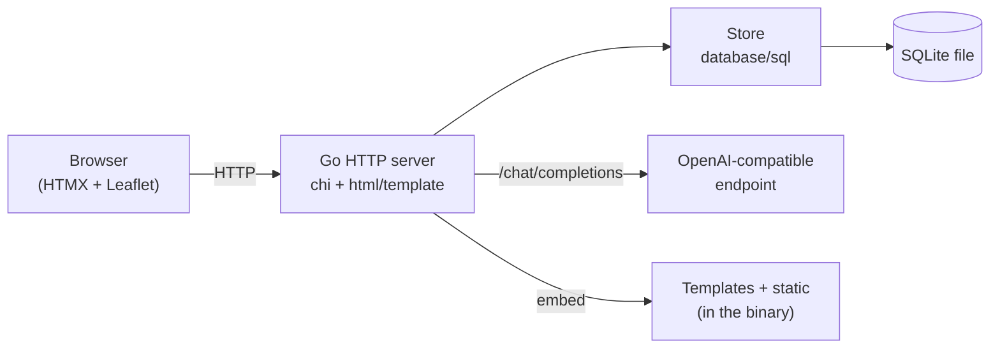

# 🌴 VacationPlanner

A web-based vacation planner written in **Go** with a modern, lightweight server-rendering
architecture (HTMX + Leaflet), SQLite persistence, OpenAI-compatible AI recommendations,
a **multi-language UI (English / German)**, and a **multi-arch, distroless** Docker image.

## Features

- **Manage vacations** – multiple planned trips with a date range (from/to), destination and notes.
- **Arrival & departure** – travel segments with transport mode, origin/destination and depart/arrive times.
- **Sights** – points of interest with category, description, date, notes and a "visited" flag.
- **Interactive map** – Leaflet + OpenStreetMap. Markers for every sight; clicking the map fills the
  coordinates for a new entry.
- **AI recommendations** – via any **OpenAI-compatible** endpoint (OpenAI, Azure OpenAI, Ollama,
  LocalAI, vLLM …). Suggestions can be added as sights with a single click.
- **Multi-language UI** – English and German, switchable under **Settings** (persisted in a cookie,
  with an `Accept-Language` fallback). Adding a language is a single catalog entry.
- **Notes** – free-form notes at the vacation, travel and sight level.
- **Secure by default** – CSRF protection, strict security headers incl. CSP, rate limiting,
  request limits, non-root distroless container.

## Tech stack

| Area      | Technology                                                            |
| --------- | -------------------------------------------------------------------- |
| Language  | Go 1.25 (static binary, `CGO_ENABLED=0`)                             |
| Routing   | `chi/v5` on top of the standard `net/http`                           |
| Database  | SQLite via `modernc.org/sqlite` (pure Go, no CGO), embedded migrations |
| Frontend  | Server-rendered `html/template` + **HTMX** + **Leaflet** (vendored)  |
| i18n      | Tiny dependency-free catalog (`internal/i18n`), English fallback     |
| AI        | OpenAI-compatible `/chat/completions` (configurable)                 |
| Container | Multi-stage → `gcr.io/distroless/static-debian12:nonroot`, multi-arch |
| Quality   | golangci-lint (v2), gosec, govulncheck, CodeQL, Trivy                |

## Architecture



All templates and static assets (including Leaflet & HTMX) are embedded into the binary via
`//go:embed` – the image stays fully self-contained and works offline.

## Quick start (Docker Compose)

Requires a running Docker daemon.

```bash
# optional: enable AI
export VP_API_KEY=sk-...
# recommended for production:
export CSRF_KEY=$(openssl rand -hex 32)

docker compose up --build
```

Then open <http://localhost:8080>

## Local development (without containers)

```bash
# 1) Configuration (optional — sensible defaults exist)
cp .env.example .env
set -a && source .env && set +a

# 2) Run — the SQLite file (DB_PATH, default ./vacation.db) and the
#    migrations are created automatically on startup.
make run     # or: go run ./cmd/server
```

More targets: `make help` (build, test, lint, sec, vuln, docker-build, docker-buildx, up, down).

## Configuration

All variables are optional — the app runs with the defaults below. The AI endpoint URL and
model are configured at runtime under **Settings** (stored in the database), not via env.

| Variable         | Default         | Description                                                              |
| ---------------- | --------------- | ----------------------------------------------------------------------- |
| `VP_API_KEY`     | –               | Empty ⇒ AI features disabled. Endpoint URL & model live in **Settings**. |
| `CSRF_KEY`       | ephemeral (dev) | Hex 32-byte HMAC key that signs CSRF tokens. **Set in production** so tokens survive restarts/instances. |
| `APP_ENV`        | `development`   | `production` enables JSON logs, HSTS, secure cookies.                    |
| `HTTP_ADDR`      | `:8080`         | Listen address.                                                         |
| `DB_PATH`        | `vacation.db`   | SQLite database file path (created if missing).                         |

### AI endpoint

Set the API key via `VP_API_KEY`. The **endpoint URL** and **model** are configured in
the app under **Settings** — for example:

| Provider     | Endpoint URL                                                      | Model         |
| ------------ | ----------------------------------------------------------------- | ------------- |
| OpenAI       | `https://api.openai.com/v1`                                       | `gpt-4o-mini` |
| Ollama       | `http://localhost:11434/v1`                                       | `llama3.1`    |
| Azure OpenAI | `https://<resource>.openai.azure.com/openai/deployments/<deploy>` | (deployment)  |

## Internationalization (i18n)

- The active language is resolved per request from the `lang` cookie, then the `Accept-Language`
  header, then the default (`en`).
- Users switch languages under **Settings** (`/settings`); the choice is stored in the `lang` cookie.
- Translations live in [internal/i18n/messages.go](internal/i18n/messages.go). To add a language,
  add a `Lang` constant plus a catalog map — a unit test enforces that every locale defines exactly
  the same keys as the English fallback.

## Security

- **CSRF**: stateless, HMAC-signed double-submit token; mandatory for all state-changing requests
  (`POST/PUT/PATCH/DELETE`).
- **Security headers**: strict `Content-Security-Policy` (self-hosted scripts/styles, only OSM tiles
  are external), `X-Content-Type-Options`, `X-Frame-Options: DENY`, `Referrer-Policy`, COOP/CORP,
  `Permissions-Policy`, HSTS (in production).
- **Robustness**: per-IP rate limiting, request body limit, timeouts, graceful shutdown.
- **Container**: distroless, non-root, static binary, no shell.
- **Output escaping**: `html/template` escapes automatically — AI-generated content is never
  rendered as raw HTML (mitigating XSS / prompt-injection impact).

> Note: there is no authentication (yet). Run the app behind a TLS reverse proxy / ingress and add
> access control if needed.

## Testing & quality

```bash
go test -race ./...     # unit tests incl. template rendering, i18n, CSRF, AI parsing
golangci-lint run       # linter suite (incl. gosec, misspell)
govulncheck ./...        # known vulnerabilities in dependencies
gofmt -l .              # formatting check
```

## CI/CD (GitHub Actions)

- **CI** (`ci.yml`): formatting, `go vet`, build, tests (race + coverage), golangci-lint,
  govulncheck (gosec runs inside golangci-lint), Trivy filesystem scan.
- **CodeQL** (`codeql.yml`): static security analysis.
- **Docker** (`docker-publish.yml`): multi-arch (`amd64` + `arm64`) build & push to GHCR with SBOM +
  provenance, followed by a Trivy image scan.
- **Dependabot**: weekly updates for Go modules, GitHub Actions and Docker.

Actions are pinned to version tags (e.g. `@v4`), which track the latest release within that major.

## Project structure

```
cmd/server/            main + health-probe subcommand
internal/
  ai/                  OpenAI-compatible client
  config/              env configuration & logger
  i18n/                translation catalog (en/de) + resolver
  models/              domain types
  server/              routing, middleware, CSRF, rendering, handlers
  store/               SQLite store + embedded migrations
web/
  templates/           layout, pages, partials
  static/              CSS, JS, vendored Leaflet/HTMX
.github/workflows/     CI, CodeQL, Docker
Dockerfile             multi-stage, multi-arch, distroless
docker-compose.yml     app + SQLite volume
```

## License

Not chosen yet – add a `LICENSE` file if needed.