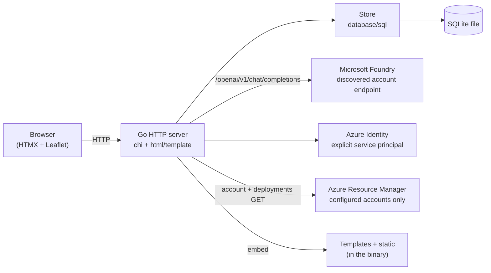

# 🌴 VacationPlanner

[](https://github.com/daknoblo/VacationPlanner/actions/workflows/ci.yml)
[](https://github.com/daknoblo/VacationPlanner/releases/latest)
[](go.mod)
[](LICENSE)
[](https://github.com/daknoblo/VacationPlanner/pkgs/container/vacationplanner)

A web-based vacation planner written in **Go** with a modern, lightweight server-rendering
architecture (HTMX + Leaflet), SQLite persistence, Microsoft Foundry AI recommendations,
a **multi-language UI (English / German)**, and a **multi-arch, distroless** Docker image.

## Features

### Trips & dashboard

- **Manage vacations** – multiple planned trips, each with a title, destination, date range
  (from/to), free-form notes and an optional **budget**, **number of people** and map location.
- **Dashboard** – a card per trip with a **budget donut** (spent vs. budget), a **countdown**
  ("in X days" / "ongoing" / "past") and quick access to the detail view.
- **Archive** – new trips stay under **Your planned vacations**, including trips entered
  with past dates. After the final calendar day has ended in the configured timezone,
  the card offers **Move to archive** instead of its past label. Archiving is manual:
  it moves the card into **Past vacations**, newest-ended first, without deleting any
  itinerary, expense, document or vocabulary data.
- **Tabbed trip detail** – Overview · General · Arrival & Departure · Accommodation · Day plan ·
  Ideas · Budget · Cheatsheet.

### Arrival & departure (travel)

- **Multi-stop travel** – arrival and departure are each an ordered list of legs with transport
  **mode** (flight / train / car / bus / ferry …), from/to locations (geocoded), depart/arrive
  times, a per-leg **cost** and notes.
- **Distance & duration** – computed per leg via **OpenRouteService** (driving) with a Haversine
  fallback, plus a summed total per direction.
- **Leg chaining** – a leg's destination auto-fills the next leg's origin; everything auto-saves.

### Accommodation (lodging)

- **Lodging cards** – name, geocoded location, check-in/check-out date & time, computed **nights**,
  **cost** (with per-night breakdown) and notes.
- Shown as a strip on the day/week planner and as a **map marker**.

### Day planner & activities

- **Unified items** – activities, sights and ideas share one model: category, description,
  coordinates, planned day, start/end time, cost, a **"visited"** flag and notes.
- **Week view** – real calendar weeks (Mon–Sun), **collapsible per week**, with drag-to-schedule
  and drag-to-move blocks (30-minute snap).
- **Day view** – an hour grid with drag/resize (5-minute snap) and a **"Route of the day"**
  (origin → distance → time between consecutive stops, using the hotel or the previous stop).
- **Activity counts** – day and week headings show assigned activities in brackets,
  including untimed entries. Counts refresh after scheduling, moving or deleting an item;
  accommodations, travel legs and unscheduled ideas do not inflate them.
- **Ideas backlog** – unscheduled items you can **drag onto the calendar** to schedule them.
- **Regional ideas** – the day/week backlog groups available ideas by geographic region
  and offers a shared region filter. Region metadata is resolved from located items;
  unlocated ideas stay visible in the unknown group. Override or clear the region in
  an item's editor when a different area grouping is more useful.
- **Inline editing** and **image thumbnails** (Wikipedia) on activities and idea rows.
- **Saved references** – adding an AI idea preserves its external links and supplied
  coordinates through editing and scheduling. Existing items without saved references
  still offer Wikipedia and Tripadvisor searches; previously discarded original URLs
  cannot be reconstructed.

### Travel cheatsheet

- Creating a vacation automatically queues a fixed selection of 22 useful words and
  phrases with the existing AI deployment: greetings, please/thank you, yes/no, help,
  food, directions and payment. The destination and coordinates guide country/language
  selection. The **Cheatsheet** tab next to Budget shows meaning, local spelling and
  pronunciation, and refreshes automatically while generation runs.
- Results are saved per trip and UI language. Opening the tab does not generate again.
  Changing the destination invalidates the displayed cache; regeneration is explicit,
  and a failed regeneration preserves the previous saved result.
- Add your own words or sentences (up to 500 characters) to translate and save them.
  Originals preserve their case; identical saved input is reused instead of translated
  again. Custom entries survive regeneration of the standard list and are scoped to the
  current destination and target language.
- Standard vocabulary, custom translations and queued/error rows now share **one table**.
  Adding a word queues only that translation, never a regeneration of the standard list.
  The input remains usable while translations run; table polling preserves typed text,
  focus and scroll. Repeated accepted submissions reuse the queue/cache.
- A single worker handles a bounded durable queue without delaying vacation creation.
  Failed or interrupted provider calls are not automatically replayed. Manual recovery
  remains available; explicit custom-translation retries are bound to the failed attempt,
  so repeating the same retry request cannot generate another call.
- AI must already be configured for automatic creation. Existing trips are not
  bulk-generated; their existing create/regenerate controls remain available.

### Map

- **Overview map** – Leaflet + OpenStreetMap shows only located accommodation records,
  including arrival/departure hotels and intermediate stays. Ideas, POIs and travel
  endpoints are excluded. The general item-data API remains available separately.
- Missing accommodation coordinates are resolved in the background from saved addresses
  or sufficiently distinctive hotel names. Only specific, unambiguous matches are accepted;
  a city center or an idea location is never substituted for a hotel. Unresolved names are
  shown with an address-check hint and a refresh action. Existing coordinates and financial
  edits are protected by conditional geo-only updates.
- **Location pickers** still support clicking to fill coordinates for a new entry;
  **zoom is remembered** per trip and chosen
  sensibly per geocoding result (country → city → address).

### Overview & budget

- **Overview** – a chronological list of travel totals, lodging and activities with color-coded
  categories, weekday/date/time, cost, and **click-to-recenter** on the map, plus **quick notes**.
- **Budget** – budget vs. spent across items, lodging and travel, broken down by category with
  icons, in the configured **currency** (€ / $).
- Larger summary/payer cards, separated booking metadata and amounts, and responsive
  spacing keep the budget readable without changing any accounting calculations.
- Budget tile contents are centered; the unassigned-cost notice links each affected
  original booking directly.
- Budget expenses are a **read-only aggregation of their original bookings**, not a second
  ledger. Source links open the existing hotel, travel leg or POI editor. Missing or
  unavailable payers remain explicit and are excluded from settlement, never guessed.
  Known payers stay selectable even when they are not trip participants.
- Travel autosaves address the original booking UUID. First saves resolve a slot inside
  a transaction, preventing concurrent autosaves from inserting duplicate bookings.
  Existing independent records are not heuristically merged or deleted.

### AI (optional)

- **AI recommendations** – via **Microsoft Foundry / Azure OpenAI**, using explicit
  service-principal authentication. Anchored to the destination with an adjustable **radius**, filtered
  against items already on the trip, with **thumbnails**; add a suggestion as an item in one click.
- **Activity suggestions** as you type, plus robust JSON extraction for chatty models and clear
  error surfacing in the log viewer.
- **Identity-only AI** – automatic account-scoped endpoint and
  deployment discovery, saved text deployment selection and separate metadata/connection checks.
  Only text Chat Completions are used: no embeddings, RAG, vision, image generation, streaming
  chat or tool calls. Destination and suggestion thumbnails are Wikipedia photo lookups, not AI.

### Geocoding & routing

- **Destination autocomplete** – server-proxied **Photon** (default) / Nominatim-compatible
  geocoding with destination bias.
- **Routing** – **OpenRouteService** (or a Haversine fallback) for driving distance/duration
  between stops.
- The daily route displays ordered legs above the day planner, from the overnight hotel
  (or the available base) to assigned stops. It ends at the last stop, without adding a
  return journey or expenses. Supply `ROUTER_API_KEY` for road distance and driving time;
  missing coordinates and straight-line estimates are shown separately from routed totals.

### Export & documents

- **Export** – a print-friendly itinerary (per day or whole trip, incl. route cards), a
  **server-generated PDF**, and an **iCal (`.ics`)** feed.
- **Document attachments** – attach files to items, travel legs and lodging; **inline preview**
  (PDF/image) in a modal or download. Files live in the database and are included in backups.

### Settings & operations

- **Multi-language UI** – English and German, switchable under **Settings** (persisted in a
  cookie with an `Accept-Language` fallback). Adding a language is a single catalog entry.
- **Regional settings** – timezone, week start and currency (the IANA database is embedded).
- **Home address**, **geocoder** and **router** base URLs, configured at runtime.
- **AI settings** – read-only discovered endpoint/status, compatible chat deployment selection,
  discovery refresh and automatic connection checking when the selected deployment changes.
  A recheck button remains; no consent checkbox or manual URL/model/API-version form.
- **Custom categories** – manage the pick-list (with an icon picker) used on item/activity forms.
- **Diagnostics** – runtime **log level** switch and an auto-refreshing **log viewer**;
  **statistics** including a document count.
- **Database maintenance** – on-demand **optimize** (VACUUM) and a configurable **auto-vacuum**
  schedule.
- **Backup & restore** – create, download, restore and delete SQLite backups.
- **About page** – build version and repository/docs links.

### Secure by default

- CSRF protection, strict security headers incl. CSP, per-IP rate limiting, request/body limits,
  timeouts, graceful shutdown and a non-root distroless container. AI-generated content is never
  rendered as raw HTML.


## Tech stack

| Area      | Technology                                                            |
| --------- | -------------------------------------------------------------------- |
| Language  | Go 1.25 (static binary, `CGO_ENABLED=0`)                             |
| Routing   | `chi/v5` on top of the standard `net/http`                           |
| Database  | SQLite via `modernc.org/sqlite` (pure Go, no CGO), embedded migrations |
| Frontend  | Server-rendered `html/template` + **HTMX** + **Leaflet** (vendored)  |
| i18n      | Tiny dependency-free catalog (`internal/i18n`), English fallback     |
| AI        | Microsoft Foundry identity-only OpenAI v1 `/chat/completions`; ARM discovery |
| Geocoding | Server-proxied Photon (default) / Nominatim-compatible (`internal/geo`) |
| Routing   | OpenRouteService with a Haversine fallback (`internal/route`)         |
| Export    | Print view, server-generated PDF (`internal/pdf`), iCal (`internal/ical`) |
| PDF       | Pure-Go `go-pdf/fpdf` with embedded Go UTF-8 fonts (`internal/pdf`)  |
| Container | Multi-stage → `gcr.io/distroless/static-debian12:nonroot`, multi-arch |
| Quality   | golangci-lint (v2), gosec, govulncheck, CodeQL, Trivy                |

## Architecture


```mermaid
flowchart LR
    Browser["Browser<br/>(HTMX + Leaflet)"] -->|HTTP| Server["Go HTTP server<br/>chi + html/template"]
    Server --> Store["Store<br/>database/sql"]
    Store --> DB[("SQLite file")]
    Server -->|/openai/v1/chat/completions| AI["Microsoft Foundry<br/>discovered account endpoint"]
    Server --> Identity["Azure Identity<br/>explicit service principal"]
    Server -->|account + deployments GET| ARM["Azure Resource Manager<br/>configured accounts only"]
    Server -->|embed| Assets["Templates + static<br/>(in the binary)"]
```

All templates and static assets (including Leaflet & HTMX) are embedded into the binary via
`//go:embed` – the image stays fully self-contained and works offline.

## Quick start (Docker Compose)

Requires a running Docker daemon.

```bash
# Optional AI: inject the four required Azure identity variables at runtime (see below).
# recommended for production:
export CSRF_KEY=$(openssl rand -hex 32)

docker compose up --build
```

Then open <http://localhost:8080>

## Local development (without containers)

```bash
# 1) Configuration (optional — sensible defaults exist)
cp .env.example .env
set -a && source .env && set +a

# 2) Run — the SQLite file (DB_PATH, default ./vacation.db) and the
#    migrations are created automatically on startup.
make run     # or: go run ./cmd/server
```

More targets: `make help` (build, test, lint, sec, vuln, docker-build, docker-buildx, up, down).

## Configuration

AI is optional and uses **Microsoft Foundry identity authentication only**. Leave all five
AI variables empty to disable it, or supply the four required values below. `CSRF_KEY` is
required in production. Non-secret settings are stored in SQLite;
credentials are supplied only through the runtime environment.

| Variable         | Default         | Description                                                              |
| ---------------- | --------------- | ----------------------------------------------------------------------- |
| `AZURE_RESOURCE_ID` | –           | Full Cognitive Services **account** resource ID for text inference; required in identity mode. |
| `AZURE_TENANT_ID` | –             | Entra tenant ID; required in identity mode. |
| `AZURE_CLIENT_ID` | –             | Application/client ID, **not** the service-principal object ID; required in identity mode. |
| `AZURE_CLIENT_SECRET` | –         | Service-principal secret, runtime injection only; required in identity mode. |
| `AZURE_IMAGE_RESOURCE_ID` | –     | Optional separate account for read-only inventory; no image generation is implemented. |
| `GEOCODER_API_KEY` | –             | Optional key for a Photon/Nominatim-compatible geocoder. Base URL in **Settings**. |
| `ROUTER_API_KEY` | –               | Optional OpenRouteService key for driving time/distance between stops. Base URL in **Settings**. |
| `CSRF_KEY`       | ephemeral (dev) | Hex 32-byte HMAC key that signs CSRF tokens. **Set in production** so tokens survive restarts/instances. |
| `APP_ENV`        | `development`   | `production` enables JSON logs, HSTS, secure cookies.                    |
| `HTTP_ADDR`      | `:8080`         | Listen address.                                                         |
| `DB_PATH`        | `vacation.db`   | SQLite database file path (created if missing).                         |

### Microsoft Foundry / Azure OpenAI

Supplying any of `AZURE_RESOURCE_ID`, `AZURE_IMAGE_RESOURCE_ID`, `AZURE_TENANT_ID`,
`AZURE_CLIENT_ID` or `AZURE_CLIENT_SECRET` requires the complete four-field identity
configuration. Incomplete or invalid identity configuration fails clearly; it never silently
uses API keys, an Azure CLI login, managed identity or a developer account instead.
When AI is disabled, Settings shows only the four required environment-variable names and
setup information, not a manual connection form.

The integration follows [ai-ui **v1.2.1**](https://github.com/daknoblo/ai-ui/tree/v1.2.1),
adapted to this application's existing Go architecture and **text-only** recommendations.
It connects directly from the backend to Azure; no AI proxy or Azure CLI in the container is
needed. The official Azure Identity SDK uses an explicit, reused `ClientSecretCredential`.
ARM discovery requests use `https://management.azure.com/.default`; inference uses
`https://cognitiveservices.azure.com/.default`. The SDK refreshes tokens in memory.
Inference sends Bearer authentication, never an `api-key` header in this mode.
Credentials and tokens never reach the browser.

Use a complete **account** ID, not a Foundry project URL, project name or deployment ID:

```text
/subscriptions/<subscription-id>/resourceGroups/<resource-group>/providers/Microsoft.CognitiveServices/accounts/<account-name>
```

1. Inject the four required variables at runtime and start/recreate the container.
2. Identity mode starts **one background metadata refresh at startup** after the server is
   wired, without blocking HTTP startup or generating content. It is canceled and joined
   before SQLite closes on shutdown. Use **Settings → Refresh discovery** for subsequent
   explicit refreshes. Both paths read ARM metadata only: they never invoke a model,
   enumerate every subscription, retrieve keys or create Azure resources. Opening Settings
   (GET) and healthchecks themselves never call Azure. Startup refreshes, like manual
   refreshes, never automatically select or change a saved deployment.
   While startup discovery is running, the AI settings section updates automatically
   from local status; status polling does not trigger additional Azure requests.
3. Settings displays the **actual discovered endpoint and status read-only**. Choose an
   actual compatible chat deployment from the main account's **select list**. A changed
   selection is saved and checked automatically.
   A deployment alias such as `<text-deployment-name>` is not the canonical model name.
4. The automatic check (or an explicit recheck) makes **one** inference request with
   `max_completion_tokens=256`, with no automatic retry, and **can incur token charges**.
   Repeated submissions of the same selected deployment do not generate another automatic
   check. Discovery success alone does not prove inference
   access. Foundry recommendations use an `8192` completion-token budget.
   A reasoning model may exhaust the small probe budget before producing visible text;
   that is reported as no text response, not as proof of invalid credentials.

The chat deployment choice is stored **only in SQLite, per main account**, keyed by its
hashed resource ID. Refreshes and cache loads never choose or replace a saved
deployment automatically; an invalid saved choice remains visible and must be corrected
explicitly. Saving an unknown or incompatible deployment is rejected. There are no manual
endpoint, model, API-version, API-key or environment-override controls.

ARM account/deployment discovery is pinned to the documented **2024-10-01** API.
Inference uses **OpenAI v1 only**, appending `/chat/completions` to the automatically resolved
v1 base URL, with the actual deployment name in `model` and **no dated `api-version`**.
The endpoint is derived from validated ARM account endpoint metadata at startup and refresh,
including applicable named endpoint metadata. Resolution deterministically prefers the
matching OpenAI API endpoint among aliases belonging to the same account. No account hostname
is hard-coded, and operators do not need to supply an endpoint manually. Base URLs must be
HTTPS, unambiguous, free of embedded credentials/query/fragment, and attributable to the
configured account. A generic `cognitiveservices.azure.com` root alone is not proof of an
OpenAI inference route; supported account metadata must establish it. Missing or invalid
metadata produces a diagnostic, not an invented endpoint or trust in a foreign host.
Unknown or incompatible model protocols are shown with a reason rather than made selectable.
A global Models API listing is not treated as proof of a deployed or usable model.
The text adapter recognizes a reviewed set of GPT-4o/4.1, GPT-5 text variants,
GPT-6 Astra, GPT-chat-latest and o-series models from the
[official model capabilities](https://learn.microsoft.com/en-us/azure/foundry/foundry-models/concepts/models-sold-directly-by-azure).
It excludes legacy models with incompatible message/output limits, Codex/pro-only APIs,
audio, realtime and unknown future names. Canonical model metadata and deployment
capabilities must both be compatible; a deployment alias cannot bypass this.
Reasoning models omit `temperature`; tool use is not needed by this application.

`AZURE_IMAGE_RESOURCE_ID` optionally reads a **separate account's inventory only**. It uses
the same identity, but independent metadata/cache/error state; equal deployment names in two
accounts are not interchangeable. Accounts may be in different resource groups/subscriptions
if accessible to that identity in the configured tenant. Empty or identical image resource
IDs do not create a second account binding. Image-account failures do not invalidate the main
account, and neither account silently substitutes for the other. There are no image-generation
requests, image deployment selectors or additional image credentials.

### Cloud Shell: inspect first, grant only with consent

The following **Azure Cloud Shell Bash** commands were checked against the official CLI and
role documentation linked below, not executed against your tenant. Replace placeholders;
use the operator's authorized tenant/subscription. The first block is read-only:

```bash
SUBSCRIPTION_ID='<subscription-id>'
RESOURCE_GROUP='<resource-group>'
ACCOUNT_NAME='<account-name>'
CLIENT_ID='<application-client-id>'
ACCOUNT_RESOURCE_ID="/subscriptions/$SUBSCRIPTION_ID/resourceGroups/$RESOURCE_GROUP/providers/Microsoft.CognitiveServices/accounts/$ACCOUNT_NAME"

az cognitiveservices account list --subscription "$SUBSCRIPTION_ID" \
  --query "[?kind=='OpenAI' || kind=='AIServices'].{name:name,group:resourceGroup,id:id,kind:kind}" \
  --output table
az cognitiveservices account deployment list --subscription "$SUBSCRIPTION_ID" \
  --resource-group "$RESOURCE_GROUP" --name "$ACCOUNT_NAME" \
  --query "[].{deployment:name,model:properties.model.name,version:properties.model.version,state:properties.provisioningState}" \
  --output table
OBJECT_ID="$(az ad sp show --id "$CLIENT_ID" --query id --output tsv)"
az role definition list --name 'Cognitive Services OpenAI User' \
  --query "[].permissions" --output json
```

The built-in **Cognitive Services OpenAI User** role currently includes
`Microsoft.CognitiveServices/*/read` (including account/deployment ARM reads) and the
OpenAI chat-completions data action. Therefore an additional **Reader is normally unnecessary**.
Verify the live definition above and effective account permissions before changing anything.
The application needs neither subscription-wide Contributor nor Owner.

**The next commands change cloud permissions and require deliberate operator consent and
permission to assign roles.** Use the SP **object ID** resolved above, never substitute the
client ID. Assign only at the explicit account scope:

```bash
test -n "$OBJECT_ID" && az role assignment create \
  --assignee-object-id "$OBJECT_ID" --assignee-principal-type ServicePrincipal \
  --role 'Cognitive Services OpenAI User' --scope "$ACCOUNT_RESOURCE_ID" --output none
```

Only if inspection establishes missing ARM read access (for example with a different custom
inference role), and after checking tenant policy, may an operator deliberately add:

```bash
test -n "$OBJECT_ID" && az role assignment create \
  --assignee-object-id "$OBJECT_ID" --assignee-principal-type ServicePrincipal \
  --role Reader --scope "$ACCOUNT_RESOURCE_ID" --output none
```

For a separate image account that is **only inventoried**, grant only its required ARM read
access at that account's exact scope (for example account-scoped Reader if not already
granted); do not grant inference rights merely for inventory. Never broaden to the subscription.
Role propagation can take several minutes. A 403 can also reflect network restrictions or
policy; do not automatically add roles to work around it.

**Optional new identity:** use your approved Entra/secret-manager provisioning workflow with a
unique application name, no default role assignments, and a **one-year secret lifetime only
if permitted by tenant policy** (otherwise use its shorter limit). The CLI's
`az ad sp create-for-rbac` supports `--years 1`, but returns a password. Creation is deliberately
deferred here rather than printing credentials or writing them to Cloud Shell storage/history,
logs, files or chat. Have an authorized operator transfer the secret directly through the
approved secret-management workflow and inject it at runtime, then use the narrow role
assignment above. Prefer separate identities per application/environment.

### Diagnostics, backups and rotation

- Settings separates configuration, cached metadata and inference verification. It displays
  unsupported deployments and safe diagnostics. Account-scoped discovery metadata, timestamps
  and sanitized error state live in the existing SQLite settings table. Failed refreshes
  preserve the last successful catalog **marked stale**, not as a successful rediscovery.
  Cached metadata is also marked stale after **24 hours**.
  Cached metadata or a saved choice is not evidence that access still works.
- Foundry inference allows at most **four concurrent calls**, rejects excess calls as busy,
  and never automatically retries them. Calls have a **90-second** timeout and **1 MiB**
  request/response limits. Discovery is bounded to **20 seconds per account**, within
  **45 seconds total**, with at most **100 pages / 10,000 deployments**, **4 MiB per response**
  and **16 MiB total per account**.
- For identity errors, check tenant/client IDs and secret expiry without displaying the
  secret. For 401/403, check identity, role scope, propagation and network policy. For
  deployment-not-found, check the selected alias and account, then explicitly refresh.
  Do not treat arbitrary 400/404 responses as a successful probe or blindly retry a
  costed request whose outcome is unknown.
- Provider error bodies are sanitized before new diagnostics are shown. HTTP redirects
  are forbidden for AI requests so credentials are
  not forwarded to another destination.
- `/healthz`, `/readyz` and the container healthcheck retain their existing local behavior:
  **no Azure calls, token acquisition or model charges**.
- Before upgrading, create and download a backup under **Settings → Backup & restore**.
  Keep the same persistent SQLite volume. The additive migration described below removes
  only obsolete AI configuration rows from the existing settings table.
  Backups include trips, attached documents, non-secret
  selections and discovery metadata, **not** runtime secrets or token caches. Treat backups
  as private data and never bundle secret-manager exports or environment dumps with them.
- Restore using the existing Settings restore workflow, re-inject runtime credentials
  separately, and review the restored selection against the currently configured account.
  Explicitly refresh and, if desired, run the costed text check. Restoring a cache does not
  authorize another resource or select a replacement deployment.
- Rotate by creating a replacement credential through the approved operator workflow,
  updating runtime secret injection, and **recreating the container**. An image rebuild is
  neither required nor a secret-delivery mechanism; restarting an existing container does
  not update its environment. Verify the new identity, then revoke the old credential.
  Do not expose secrets through shell tracing, environment dumps, rendered Compose output,
  debug logs, image build arguments or repository files. All Azure mutations remain explicit
  operator actions, never startup/healthcheck behavior.

### Breaking upgrade: identity-only AI

The trip-experience update additionally applies migration `0018_item_links.sql`
and `0019_cheatsheets.sql` to retain item references and cached travel vocabulary.
Automatic creation and custom translations add `0020_cheatsheet_jobs.sql` and
`0021_cheatsheet_custom_phrases.sql`. Job state and translations are included in
normal SQLite backups; no new environment variables are required.
Incremental phrase jobs and geographic region fields add migrations
`0022_cheatsheet_phrase_jobs.sql` and `0023_item_regions.sql`. Geography enrichment uses
the existing geocoder configuration, one worker, at most one request per second,
40 lookups per batch and a 90-second deadline. A five-minute cooldown avoids repeatedly
requesting unresolved places; the refresh action can explicitly continue a limited batch.
Automatic region labels use a consistent language; manual area names remain untouched.
Migration `0024_vacation_archive.sql` adds a default-off archive flag. Existing vacations
are not archived automatically; normal trip edits retain the manual archive state.
Back up before updating and keep the same database volume. Route views do not add
expense records. Existing costs without a payer remain visible until explicitly
assigned at the original booking.

The API-key provider mode and classic Azure inference adapter have been **removed**.
Generic OpenAI, Ollama, LocalAI and vLLM API-key configurations no longer enable AI.
The application no longer reads `VP_API_KEY`, `AZURE_ENDPOINT`, `AZURE_DEPLOYMENT`,
`AZURE_MODELS` or `AZURE_API_VERSION`; remove these obsolete variables from deployment
configuration. In particular, an old `AZURE_ENDPOINT` workaround is no longer needed:
the account's supported OpenAI endpoint is resolved automatically from validated ARM metadata.

Before upgrading, download a backup. Startup applies additive migration
`0017_remove_legacy_ai_settings.sql`, deleting **only** the obsolete `ai.base_url`, `ai.model`
and `ai.api_version` settings. Trips, attachments, saved Foundry deployment choices and
per-account discovery caches are preserved. Older backups remain restorable through the
existing workflow; migrations are reapplied, so restoring does not re-enable the removed
provider mode.

To use AI after upgrading, inject the four required identity variables, keep the same data
volume, and recreate the container. Review discovery status in Settings, explicitly select
a compatible deployment if none is saved; selection automatically checks it. Existing
saved Foundry choices are never automatically switched to a different deployment.

Verified references:
[ARM account GET](https://learn.microsoft.com/en-us/rest/api/aiservices/accountmanagement/accounts/get?view=rest-aiservices-accountmanagement-2024-10-01),
[ARM deployment list](https://learn.microsoft.com/en-us/rest/api/aiservices/accountmanagement/deployments/list?view=rest-aiservices-accountmanagement-2024-10-01),
[v1 API lifecycle](https://learn.microsoft.com/en-us/azure/foundry/openai/api-version-lifecycle),
[OpenAI User permissions](https://learn.microsoft.com/en-us/azure/role-based-access-control/built-in-roles/ai-machine-learning#cognitive-services-openai-user),
[deployment CLI](https://learn.microsoft.com/en-us/cli/azure/cognitiveservices/account/deployment?view=azure-cli-latest#az-cognitiveservices-account-deployment-list),
[service-principal CLI](https://learn.microsoft.com/en-us/cli/azure/ad/sp?view=azure-cli-latest),
[role assignment CLI](https://learn.microsoft.com/en-us/cli/azure/role/assignment?view=azure-cli-latest#az-role-assignment-create).

## Internationalization (i18n)

- The active language is resolved per request from the `lang` cookie, then the `Accept-Language`
  header, then the default (`en`).
- Users switch languages under **Settings** (`/settings`); the choice is stored in the `lang` cookie.
- Translations live in [internal/i18n/messages.go](internal/i18n/messages.go). To add a language,
  add a `Lang` constant plus a catalog map — a unit test enforces that every locale defines exactly
  the same keys as the English fallback.

## Security

- **CSRF**: stateless, HMAC-signed double-submit token; mandatory for all state-changing requests
  (`POST/PUT/PATCH/DELETE`).
- **Security headers**: strict `Content-Security-Policy` (self-hosted scripts/styles, only OSM tiles
  are external), `X-Content-Type-Options`, `X-Frame-Options: DENY`, `Referrer-Policy`, COOP/CORP,
  `Permissions-Policy`, HSTS (in production).
- **Robustness**: per-IP rate limiting, request body limit, timeouts, graceful shutdown.
- **Container**: distroless, non-root, static binary, no shell.
- **Output escaping**: `html/template` escapes automatically — AI-generated content is never
  rendered as raw HTML (mitigating XSS / prompt-injection impact).

> Note: there is no authentication (yet). Run the app behind a TLS reverse proxy / ingress and add
> access control if needed.

## Testing & quality

```bash
go test -race ./...     # unit tests incl. template rendering, i18n, CSRF, AI parsing
golangci-lint run       # linter suite (incl. gosec, misspell)
govulncheck ./...        # known vulnerabilities in dependencies
gofmt -l .              # formatting check
```

## CI/CD (GitHub Actions)

- **CI** (`ci.yml`): formatting, `go vet`, build, tests (race + coverage), golangci-lint,
  govulncheck (gosec runs inside golangci-lint), Trivy filesystem scan.
- **CodeQL** (`codeql.yml`): static security analysis.
- **Docker** (`docker-publish.yml`): multi-arch (`amd64` + `arm64`) build & push to GHCR with SBOM +
  provenance, followed by a Trivy image scan.
- **Dependabot**: weekly updates for Go modules, GitHub Actions and Docker.

Actions are pinned to version tags (e.g. `@v4`), which track the latest release within that major.

## Project structure

```
cmd/server/            main + health-probe subcommand
internal/
  ai/                  Foundry-backed text recommendations and suggestions
  applog/              structured logging + runtime level + in-memory log ring
  config/              env configuration & logger
  destimg/             destination image lookup/proxy (Wikipedia)
  foundry/             explicit Azure identity, ARM discovery/catalog cache, guarded inference
  geo/                 server-proxied geocoding (Photon/Nominatim)
  i18n/                translation catalog (en/de) + resolver
  ical/                iCal (.ics) itinerary export
  models/              domain types
  pdf/                 server-generated PDF itinerary
  route/               driving distance/duration (OpenRouteService + Haversine)
  server/              routing, middleware, CSRF, rendering, handlers
  store/               SQLite store, backups + embedded migrations
  version/             build version
web/
  templates/           layout, pages, partials
  static/              CSS, JS, vendored Leaflet/HTMX
.github/workflows/     CI, CodeQL, Docker
Dockerfile             multi-stage, multi-arch, distroless
docker-compose.yml     app + SQLite volume
```

## License

Released under the [MIT License](LICENSE).